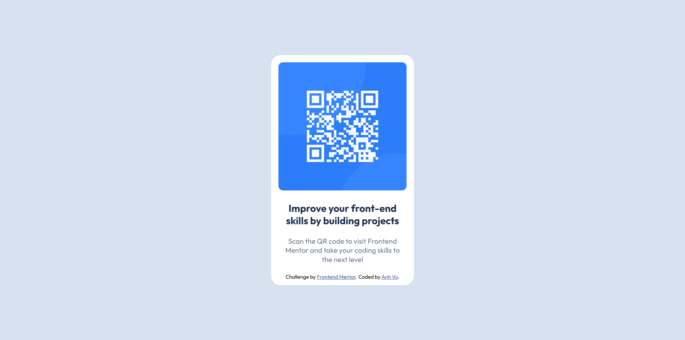

# Frontend Mentor - QR code component solution

This is a solution to the [QR code component challenge on Frontend Mentor](https://www.frontendmentor.io/challenges/qr-code-component-iux_sIO_H). Frontend Mentor challenges help you improve your coding skills by building realistic projects.

## Table of contents

- [Overview](#overview)
  - [Screenshot](#screenshot)
  - [Links](#links)
- [My process](#my-process)
  - [Built with](#built-with)
  - [What I learned](#what-i-learned)
- [Author](#author)

## Overview

### Screenshot

#### Desktop Version



#### Mobile Version


### Links

- Solution URL: [TBA](tba)
- Live Site URL: [TBA](tba)

## My process

### Built with

- Semantic HTML5 markup
- CSS custom properties
- Flexbox

### What I learned

I manage to center a div without having to google it xd

```css
.container {
  display: flex;
  flex-direction: column;
  justify-content: center;
  align-items: center;
  background-color: white;
  width: 300px;
  position: absolute;
  top: 50%;
  left: 50%;
  transform: translate(-50%, -50%);
  border-radius: 20px;
}
```

## Author

- Frontend Mentor - [@anhvu1012](https://www.frontendmentor.io/profile/anhvu1012)
